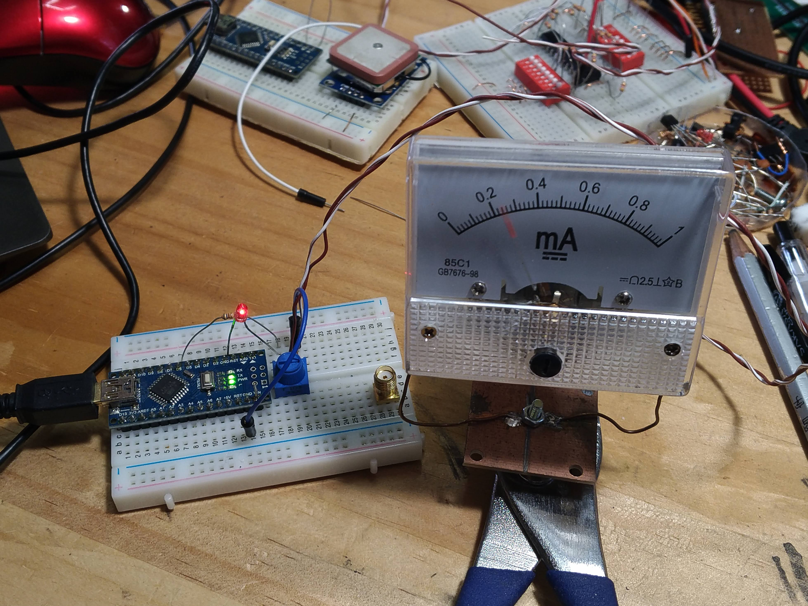

# AnalogMeterTrainer

This program will rehabilitate the analog meter so that it will function properly forever.
Connect pin 6 of the Arduino to the analog meter with a variable resistor. Adjust the meter so that it is at full scale when the output voltage is at maximum.

